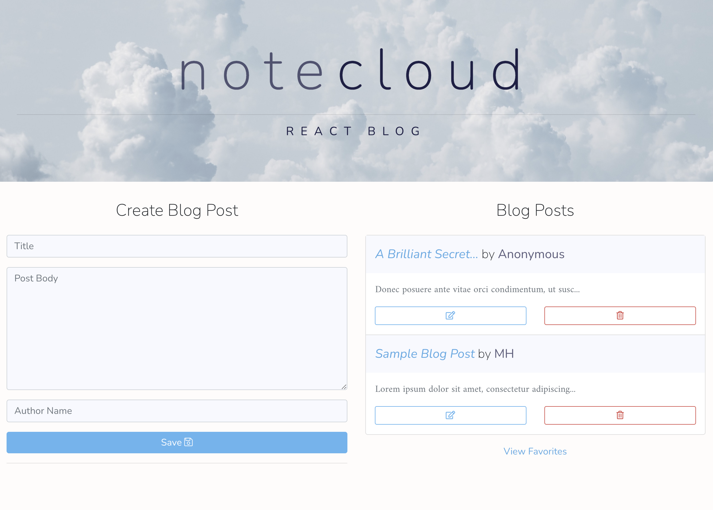
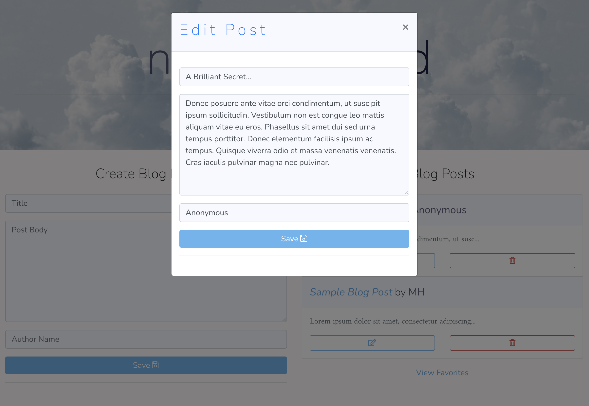
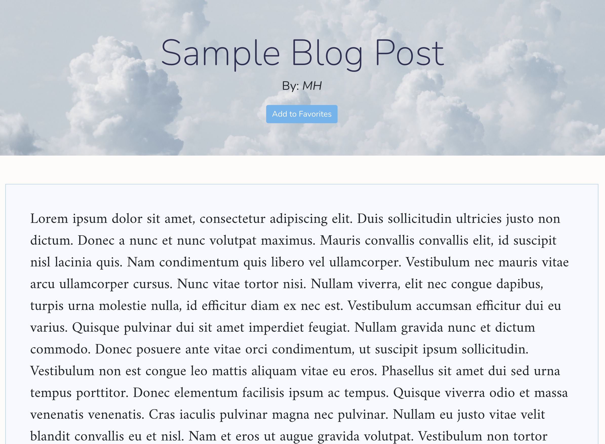

# React Blog Application

## Deployed Application

[React Blog Application](https://blogapplication-mh.herokuapp.com/)

## Description 

This in-progress full-stack web application allows users to write and read personal blog posts and mark favorites.

When the user navigates to the homepage, two main React components are rendered. The first is a form allowing a user to write/save a new blog post, and the other is a list of previous saved posts retrieved from the database. The user may delete old blog posts from this view or click a saved post to view the Detail page in order to read the entire blog post body. Finally, the user may click a button to save this post as a favorite (this feature currently persists only in current session) and view the Favorites page to view all saved favorites.

This application stores user data in MongoDB Atlas while online. The form to create a new blog post can only be submitted with a title and a post body, but the author field will be automatically set to 'anonymous' if no author is entered.

## Features

* Node.js back-end with Express routing. 
* React front-end with React Router to handle pages.
* React components organize page functions and elements.
* Utilizes React Context API to manage state globally.
* MongoDB/Mongoose stores and retrieves blog posts.
* Incorporates Bootstrap for styling. 

## Credits

Michael Hanson
* michaeledwardhanson@gmail.com
* [GitHub](https://github.com/mhans003)
* [LinkedIn](https://www.linkedin.com/in/michaeledwardhanson/)

## License 

Licensed under the [MIT License](./LICENSE.txt).